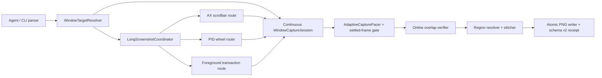
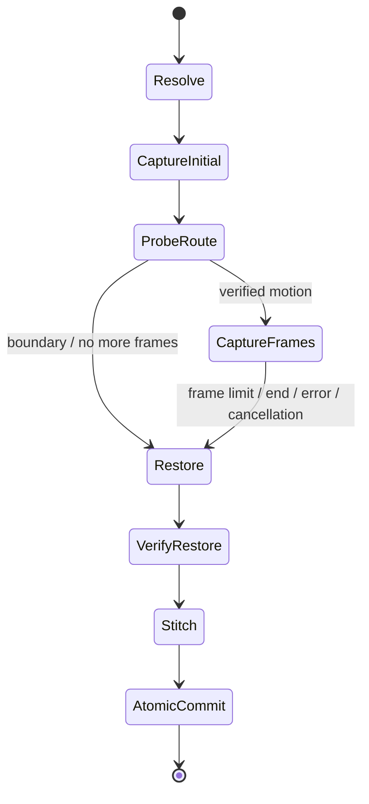

# Architecture

## Product thesis

`longview` is a narrow native capability beneath an agent, not an agent and not a GUI automation framework. Its deep interface is:

```text
explicit window target + bounded capture policy -> PNG artifact + machine-verifiable receipt
```

The implementation separates capture from scrolling because macOS grants them different powers. ScreenCaptureKit can capture a selected window without making it frontmost; changing that window's viewport depends on what the target App exposes.

## Ownership boundaries



- `WindowTargetResolver` owns discovery and the PID/windowID/frame identity tuple.
- `WindowCaptureSession` owns one continuous `SCStream` over `SCContentFilter(desktopIndependentWindow:)`, settled-frame detection, and a one-shot fallback. It never resolves "current foreground" implicitly.
- `WindowScrollSessions` owns every longshot mutation and restoration action.
- `SystemScrollEventPoster` is the only module allowed to construct and post wheel events.
- `AdaptiveCapturePacer` owns closed-loop scroll displacement. It treats captured overlap as truth and event counts as a tentative actuator.
- `LongScreenshotStitcher` owns motion confidence, coarse-to-fine overlap, document ordering, transparent-edge composition and crop semantics.
- `LongviewCLIKit` owns stable arguments, JSON envelopes, exit codes and atomic output.

The test-only AppKit fixture is a SwiftPM target but not a package product and cannot enter the distributed CLI.

## Route ladder

The coordinator captures an immutable first frame, then probes routes in order:

1. AX scrollbar action/value: mutate a live scrollbar without activation, capture, verify vertical document motion.
2. PID-targeted wheel: post directly to the selected PID and coordinate, capture, verify motion.
3. Foreground transaction: only if policy permits and the exact window is visible on the active Space; activate, place pointer, post global wheel, capture and verify.

A route is selected only after observed pixels prove motion. Event-post success is not considered scroll success.

Profiles may remove a route that has already been proven ineffective for one
App. For example, WeChat's `background-first` path goes from AX directly to the
recoverable foreground transaction instead of spending time on a known no-op
PID event. `background-only` always performs the real background probe, so an
optimization can never silently weaken an explicit policy.

## Adaptive capture loop

Forward event routes emit at a one-millisecond cadence and use a 50-millisecond
stable-frame gate. Restoration uses a more conservative two-millisecond cadence;
AX mutation and restoration use a 100-millisecond gate. Each mutation is
observed by the continuous capture stream rather than followed by a fixed sleep.
If no newer frame arrives, the session reuses its current stream snapshot rather
than paying for a one-shot capture. Intermediate render states are never
committed: the settled viewport must prove the minimum overlap invariant. The
next scroll step is derived from measured displacement, bounded against sudden
acceleration, and reduced before overlap becomes unsafe.

This makes speed an observed property of the target App rather than a global
constant. A slow renderer naturally throttles; a fast renderer approaches the
ScreenCaptureKit cadence without changing the correctness contract.

## Transaction and restoration



The transaction records original scrollbar value, frontmost application and pointer location before mutation. Restoration order is deliberate:

1. reacquire the target lease only when the CLI itself activated it;
2. restore the viewport;
3. capture again and verify that the viewport returned to the initial vertical
   position, with tolerance for localized dynamic content;
4. restore pointer and original frontmost application;
5. emit the receipt.

Viewport, pointer and focus restoration are reported independently; the
environment receipt is the conjunction of pointer and focus. Cancellation does
not suppress cleanup delays or inverse events.

## Target identity

`windowID` is the primary key. Bundle identifier is optional metadata and a useful discovery filter. This permits agent-created executables and development Apps without an application bundle to participate.

The lease rejects changes to:

- owner PID;
- WindowServer window ID;
- window frame beyond a small compositor tolerance;
- frontmost PID for global events;
- pointer containment for global events.

## Crop and stitch policy

- Known profiles may define an exact content rectangle and one fixed header.
- Generic `auto` removes only fixed top/bottom chrome. It intentionally does not infer horizontal sidebars from frame difference because margins, avatars and line numbers can look static.
- Explicit normalized rectangles are the escape hatch for nested scroll regions.
- Every committed transition proves at least 24% overlap; unverified frames never enter the artifact.
- Capture-time overlaps are reused during composition instead of being recomputed.
- Sparse row-feature scoring narrows candidates before dense feature validation.
- Overlap is computed from informative pixels, not raw full-frame equality.
- Transparent window corners are composited over the dominant document background rather than cropped from the final page.

## Why no private window automation

Private SkyLight/CGS calls could switch Spaces or inject window-targeted events more aggressively, but they would create OS-version fragility, signing risk and an unreviewable trust boundary. The public-API product instead reports the exact unsupported state:

- capture unavailable;
- background scroll unavailable;
- foreground window unavailable on active Space;
- target lease changed;
- restoration unverified.

This is a stronger agent primitive because failure is stable and machine-actionable.

## Extension points

New App support should arrive through one of three bounded additions:

1. a crop profile keyed by bundle ID;
2. a public, capture-verified `WindowScrollSession` strategy;
3. agent-supplied `--region` and `--scroll-point` values.

No App-specific behavior belongs in the CLI parser, capture session or event poster.
